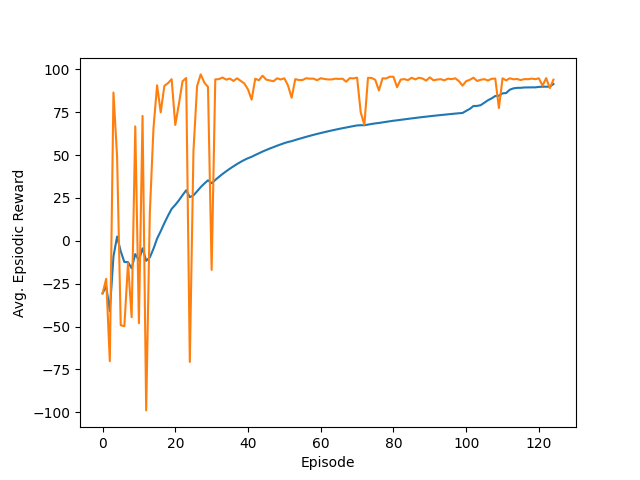
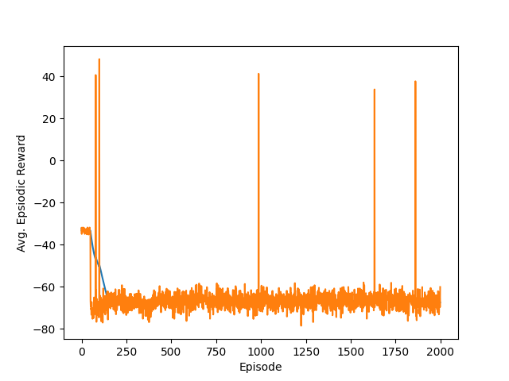
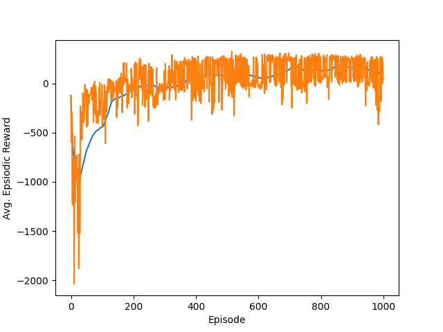

# Assignment 3 - CS5891-04
This project is intended to solve the _MountainCarContinous_ problem using *Policy Gradient Reinforce- Monte Carlo* and *DDPG*. Along with this DDPG is also used to solve _LunarLanderContinuous_ env.

## Mountain Car Problem
To solve this problem two different approach is used, one is _DDPG_ and another one is _Reinforce_. 

### Training
To train the model you can use *train_MountainCarContinuous_mangalsv.py* file. To run this file simply run following command

```bash
python train_MountainCarContinuous_mangalsv.py -a <agent> # choice of agent ddpg and reinforce
```
The above command will start training on the most optimized parameter and attempt to solve the enviornment based on that also more information about the available options could be found using following command:

```bash
python train_MountainCarContinuous_mangalsv.py --help
```
Output:
```bash
Usage: Script to train the MountainCar Continous model using Reinforce and DDPG algorithm

Options:
  -h, --help            show this help message and exit
  -a AGENT, --agent=AGENT
                        Select an agent to train MountainCarContinous model,
                        default: ddpg
  -e TOTAL_EPISODES, --total_episodes=TOTAL_EPISODES
                        Mention total number of epochs to run, default: 500
  -s START_EPISODE, --start_episode=START_EPISODE
                        Specify the start episode for reinforce algorithm,
                        default: 50
  -l LR, --lr=LR        Specify the learning rate for training the model,
                        default: 5e-4
  --num_hidden_states=NUM_HIDDEN_STATES
                        Hidden layer architecture for the models, default:
                        64,64
  --std=STD             Specify the standard dev for the ou noise, default:
                        5e-1
  -b BUFFER_SIZE, --buffer_size=BUFFER_SIZE
                        Specify the buffer size for keeping the length of
                        replay buffer, default: 5000
  --batch_size=BATCH_SIZE
                        Specify the batch size for the training batch, default
                        to 64
  --plot_name=PLOT_NAME
                        Specify the name of plot to save, default:
                        mountain_car.png
```
> Note: The default values shown in the output above are the hyperparms selected for training the agents. LR is shared between critic and actor in case of DDPG.

*All the trained weights are stored inside trained_models folder*

### Testing
To train the model you can use *test_MountainCarContinuous_mangalsv.py* file. To run this file simply run following command

```bash
python test_MountainCarContinuous_mangalsv.py -a <agent> # choice of agent ddpg and reinforce
```
The above command will start testing the agent for the saved weights. It will run 10 episodes for each agent and log the episodic rewards for each run. More information about the ussage of this script could be found using following command

```bash
python test_MountainCarContinuous_mangalsv.py --help
```
Output:
```bash
Usage: Script to test the MountainCar Continous model using Reinforce and DDPG algorithm

Options:
  -h, --help            show this help message and exit
  -a AGENT, --agent=AGENT
                        Select an agent to test MountainCarContinous model,
                        default: ddpg
  -e TOTAL_EPISODES, --total_episodes=TOTAL_EPISODES
                        Mention total number of epochs to run, default: 10
  --num_hidden_states=NUM_HIDDEN_STATES
                        Hidden layer architecture for the models, default:
                        64,64
  -w WEIGHT_PATH, --weight_path=WEIGHT_PATH
                        Specify the path of weights to load
```
> Note: The default values shown in the output above are the hyperparms selected for testing and it loads the weights for the agent from trained_models dir. Custom weights could be loaded by specifing the path of the weights.

## LunarLanding Problem
To solve this problem only _DDPG_ is used. 

### Training
To train the model you can use *train_lunarlander_continuous_mangalsv.py* file. To run this file simply run following command

```bash
python train_lunarlander_continuous_mangalsv.py -a ddpg # only ddpg is available and -a flag is optional.
```
The above command will start training on the most optimized parameter and attempt to solve the enviornment based on that also more information about the available options could be found using following command:

```bash
python train_lunarlander_continuous_mangalsv.py --help
```
Output:
```bash
Usage: Script to train the LunarLandingContinous agent using DDPG algorithm

Options:
  -h, --help            show this help message and exit
  -a AGENT, --agent=AGENT
                        Select an agent to train LunarLandingContinous model,
                        default: ddpg
  -e TOTAL_EPISODES, --total_episodes=TOTAL_EPISODES
                        Mention total number of epochs to run, default: 1000
  -l LR, --lr=LR        Specify the learning rate for training the model,
                        default: 5e-4
  --num_hidden_states=NUM_HIDDEN_STATES
                        Hidden layer architecture for the models, default:
                        512,512
  --std=STD             Specify the standard dev for the ou noise, default:
                        1e-1
  -b BUFFER_SIZE, --buffer_size=BUFFER_SIZE
                        Specify the buffer size for keeping the length of
                        replay buffer, default: 100000
  --batch_size=BATCH_SIZE
                        Specify the batch size for the training batch, default
                        to 64
  --plot_name=PLOT_NAME
                        Specify the name of plot to save, default:
                        lunarlander_mangalsv.png
```
> Note: The default values shown in the output above are the hyperparms selected for training the agents. LR is shared between critic and actor in case of DDPG.

*All the trained weights are stored inside trained_models folder*

### Testing
To train the model you can use *train_lunarlander_continuous_mangalsv.py* file. To run this file simply run following command

```bash
python train_lunarlander_continuous_mangalsv.py -a ddpg # only ddpg is available and -a flag is optional.
```
The above command will start testing the agent for the saved weights. It will run 10 episodes for each agent and log the episodic rewards for each run. More information about the ussage of this script could be found using following command

```bash
python train_lunarlander_continuous_mangalsv.py --help
```
Output:
```bash
Usage: Script to test the LunarLandingContinous agent using DDPG algorithm

Options:
  -h, --help            show this help message and exit
  -a AGENT, --agent=AGENT
                        Select an agent to test LunarLandingContinous model,
                        default: ddpg
  -e TOTAL_EPISODES, --total_episodes=TOTAL_EPISODES
                        Mention total number of epochs to run, default: 10
  --num_hidden_states=NUM_HIDDEN_STATES
                        Hidden layer architecture for the models, default:
                        512,512
  -w WEIGHT_PATH, --weight_path=WEIGHT_PATH
                        Specify the path of weights to load
```
> Note: The default values shown in the output above are the hyperparms selected for testing and it loads the weights for the agent from trained_models dir. Custom weights could be loaded by specifing the path of the weights.

## Training Logs
### Training Logs for the MountainCar DDPG



### Training Logs for the MountainCar Reinforce



### Training Logs for the LunarLanding DDPG



## Experimentation
All the logs for training agents are present in this repo as train_logs_*.txt which can be used to get more details about the training time, number of steps etc for the training. Rough stats about the training time are as follows:
* Reinforce Mountain Car : _34 mins for 2000 iters. (Not Converged)_
* DDPG Mountain Car : _3.5 mins for 124 iters, solved at 124_
* DDPG Lunar Landing : _64 mins for 1000 iters. (Avg Score Oscillated b/w 100-170)_

## Citations
1. https://github.com/DLR-RM/rl-baselines3-zoo (Mountain Car DDPG)